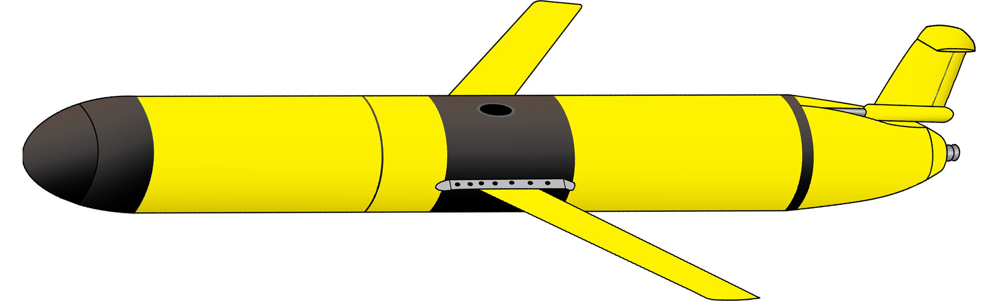
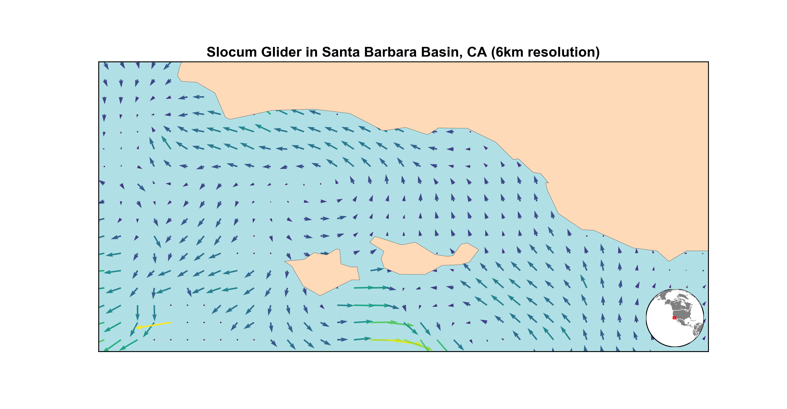
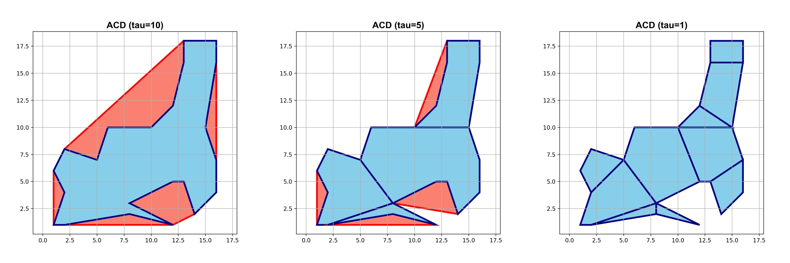

<a href="https://github.com/zduguid">
    
</a>


# Slocum Glider Path Planner
The Slocum Glider is an autonomous underwater vehicle (AUV) that is specialized for long range research scenarios. To optimize the performance of the Slocum Glider and reap greater science reward for a given mission, it is necessary to consider energy-optimal routes. To compute these energy optimal routes, an Markov Decision Process (MDP) framework is used which takes advantage of dynamic programming methods and Monte Carlo Tree Search (MCTS) and information regarding the ocean currents. In this repository, a script for accessing and visualizing ocean currents is presented and a function that computes the optimal energy expenditure for a given transition of the MDP is discussed. Also, a method for decomposing irregular polygons into smaller convex pieces, known as Approximate Convex Decomposition (ACD), is proposed. 


## Table of Contents
- [Getting Started](#getting-started)
    - [Dependencies](#dependencies)
    - [Ocean Current Data](#ocean-current-data) 
- [Ocean Currents](#ocean-currents)
- [Optimal Energy](#optimal-energy)
- [ACD](#acd)
- [Acknowledgements](#acknowledgements)


## Getting Started 
To run this script, you will need to satisfy the following [Dependencies](#dependencies). To access ocean current information in either OPeNDAP or NCSS format, you will need to access [Ocean Current Data](#ocean-current-data).


### Dependencies 
* The ```ocean_currents.py``` script is written in ```Python3``` [(Python3 Download)](https://www.python.org/downloads/)
* The ```optimal_energy.lisp``` script is written in ```Lisp``` [(SBCL Download)](http://www.sbcl.org/platform-table.html)
* ```netCDF4``` is used to retrieve ocean current information [(netCDF)](http://unidata.github.io/netcdf4-python/)
* ```matplotlib``` is used to create various plots [(matplotlib)](https://matplotlib.org)
* ```numpy``` is used to create array objects for graphing [(numpy)](http://www.numpy.org)
* ```Basemap``` works with ```matplotlib``` to create world map graphs [(Basemap)](https://matplotlib.org/basemap/)
* ```PyProj``` is a necessary dependency for ```Basemap``` [(PyProj)](https://pypi.python.org/pypi/pyproj?)


### Ocean Current Data
Several options are available for retrieving ocean current methods:
* HF Radar Network via [CORDC THREDDS](http://hfrnet.ucsd.edu/thredds/catalog.html)
* [OPeNDAP](http://hfrnet.ucsd.edu/thredds/dodsC/HFR/USWC/2km/hourly/RTV/HFRADAR,_US_West_Coast,_2km_Resolution,_Hourly_RTV_best.ncd.html) format (for Santa Barbara 2km)
* [NetcdfSubset](http://hfrnet.ucsd.edu/thredds/ncss/grid/HFR/USWC/2km/hourly/RTV/HFRADAR,_US_West_Coast,_2km_Resolution,_Hourly_RTV_best.ncd/dataset.html) format (for Santa Barbara 2km)


## Ocean Currents
The ```ocean_currents.py``` script reads in a ```netCDF4``` file, stores the ocean current information in a usable format, and produces a map of the result. The figure below shows an example output of this script.




## Optimal Energy
The ```optimal_energy.lisp``` script computes the energy optimal transition between two waypoints given the start and end waypoint locations, the ocean current conditions, and the hotel load information. The script is capable of returning either the optimal energy loss needed to make the transition or the glider velocity in cartesian coordinates. This script includes several useful unit tests that showcase how the optimal glider velocity changes as a result of different hotel load scenarios and ocean current conditions.


## ACD
The ```ACD.py``` script takes in an input polygon and tolerance parameter tau, and returns a list of polygons that satisfy the decomposition condition of the ACD algorithm. More information regarding the ACD algorithm can be found [here](http://masc.cs.gmu.edu/wiki/ACD). 

An example output for the ACD algorithm is shown below for varying values of the tolerance parameter tau when the algorithm is applied to a small irregular polygon. In this example, the blue area represents the resulting polygons that are returned from the ACD algorithm after the input polygon has been decomposed, and the red area represents the non-convex areas found in the resulting obstacle representation. Thus, more red area represents more inefficiencies and lost space in regards to viable sample locations. When tau is equal to 10, the tolerance is too high and no decomposition occurs. When tau is lowered, further decomposition takes place until eventually the output entirely consists of convex pieces. In general, setting tau to 0 (no tolerance at all) will yield the complete convex decomposition of the input. However, this may not necessarily be desired because small surface textures may lead to an excessively high number of polygons in the final output.




## Author
* **[Zach Duguid](https://zduguid.github.io)**


## Acknowledgements
* Computer Science and Artificial Intelligence Laboratory (CSAIL), MIT
* Deep Submergence Laboratory, WHOI
* National Science Foundation (NSF)
* Research Supervisors: Brian Williams & Rich Camilli